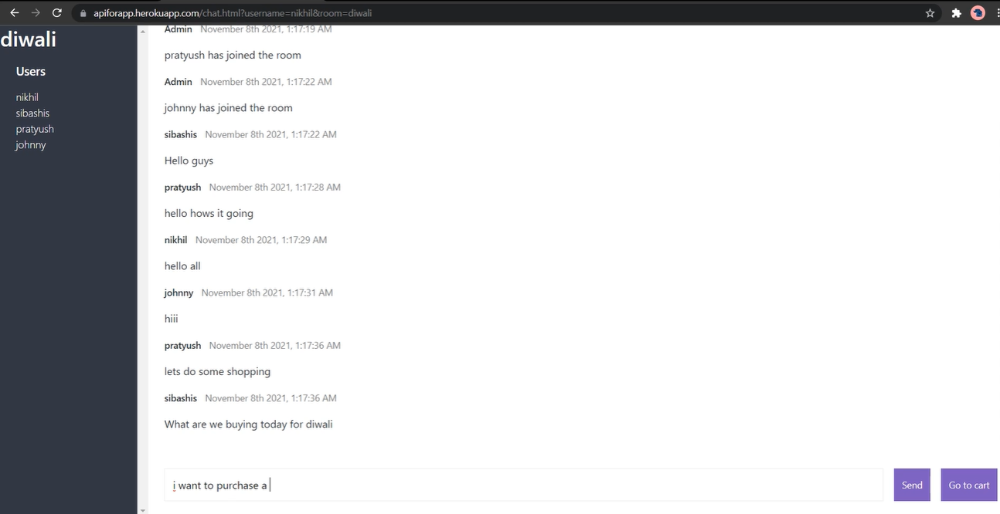
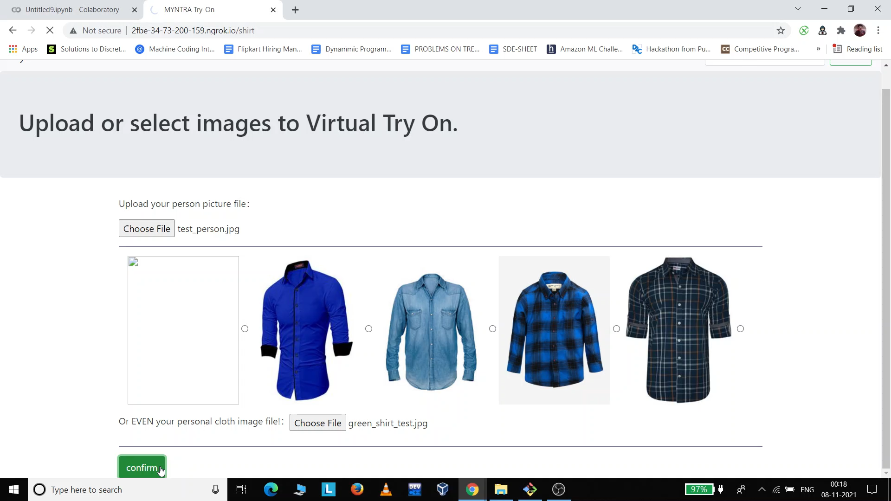

# Responsive-Ecommerce-Website
Front-end for an e-commerce clothes selling website.
## About
1- It is a responsive webpage containing nice animations.  
2- Contains a well authenticated contact, login and sinup froms. 
3- Contains many categories regarding clothes. 
4- A nice Footer. 
5- Authenticated Payment Page. 
5- A nice Cart Page.
## Screenshots

## Virtual Try On

LINK : https://github.com/ayush777-hub/virtual_try_on_improvised

SCREENSHOTS

