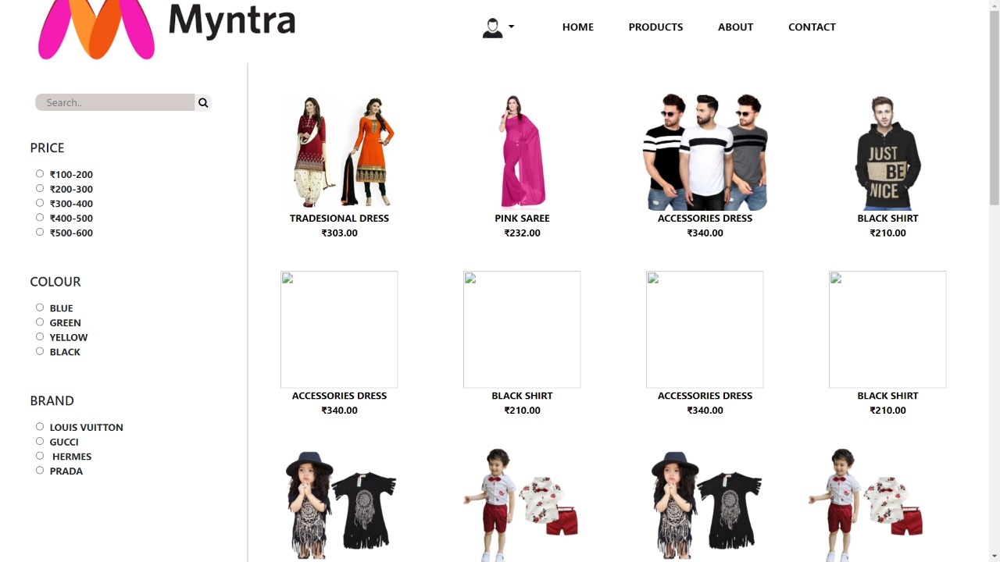
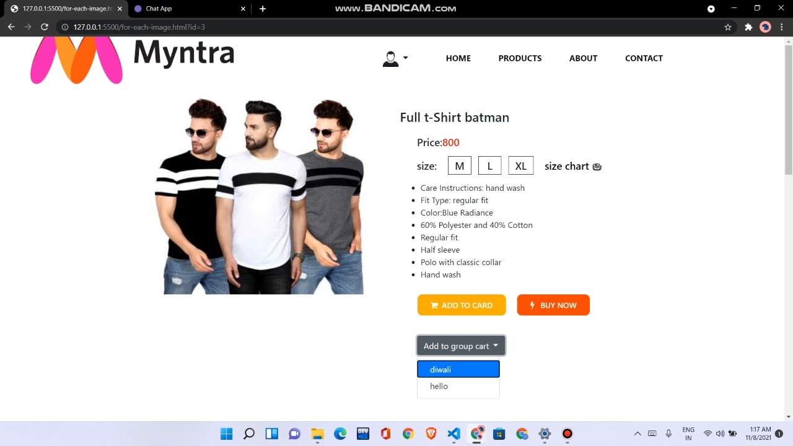
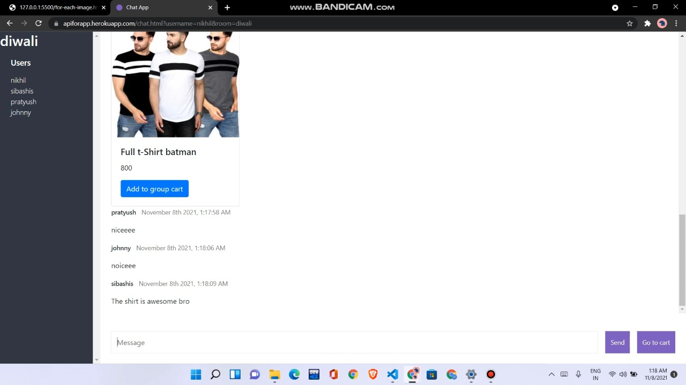
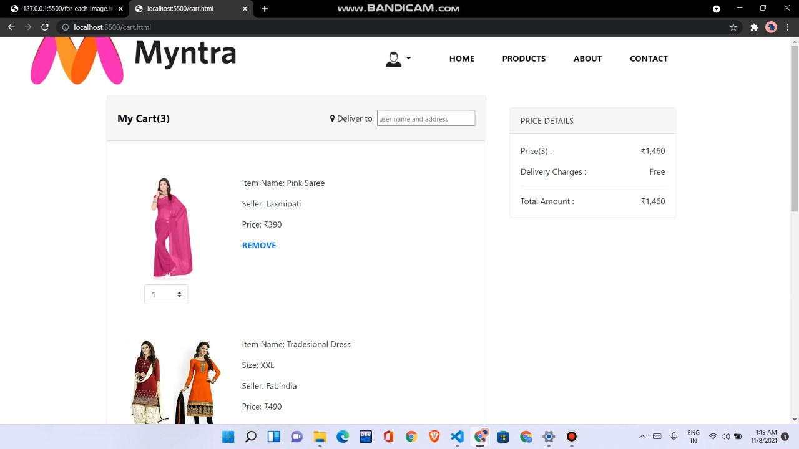
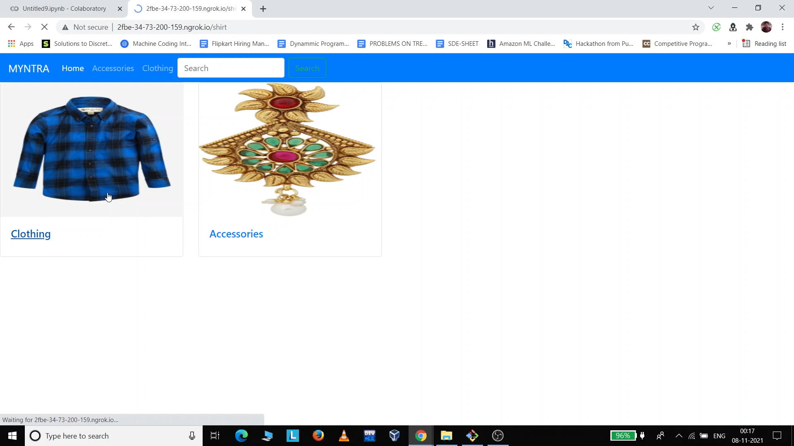
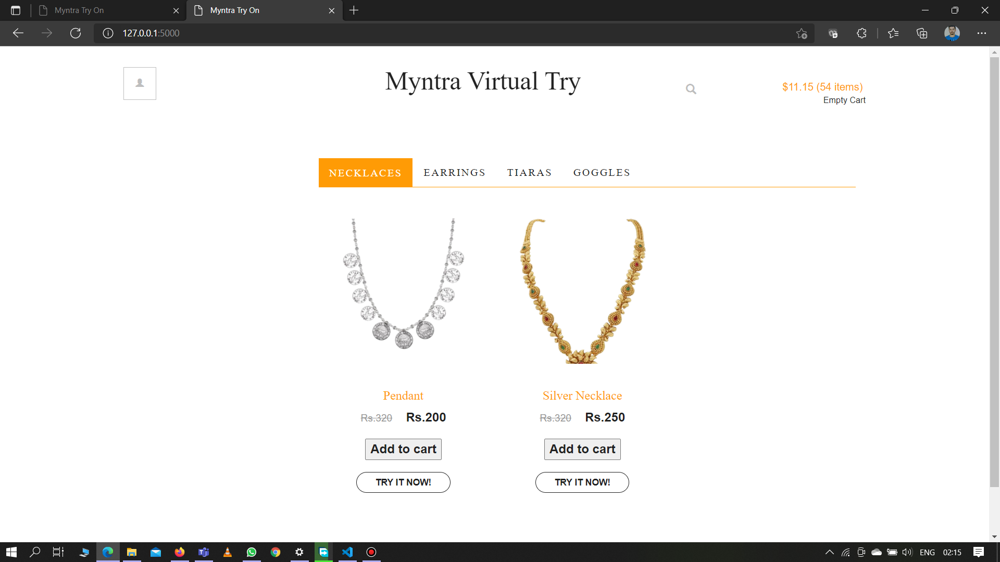
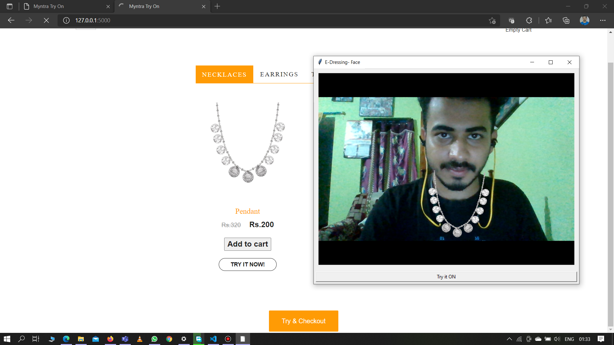
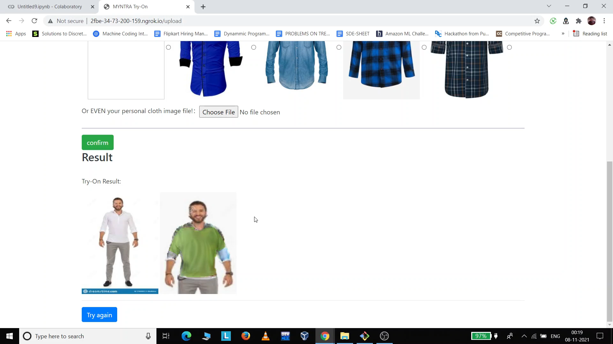

# Super Myntra
**Collaborative shopping with friends and virtual try on **

## About
1- It is a webpage which mimics myntra page and adds some new features.  
2- This webpage contains a chat and common group cart feature.  
3- Users can interact with friends while shopping and make their final purchase. 
4- Along with this feature, this webpage introduces virtual trail room feature.  
5- Users can try different products there itself in webpage, making a more confident purchase.  
6- All basic e-commerce website features are implemented.

## Virtual Try On
The virtual Trail feature is implemented in another repository
Further Instruction are written in the below repo:
**LINK : https://github.com/ayush777-hub/virtual_try_on_improvised

## Screenshots
**CART FEATURE**

**VIRTUAL TRY ON**

